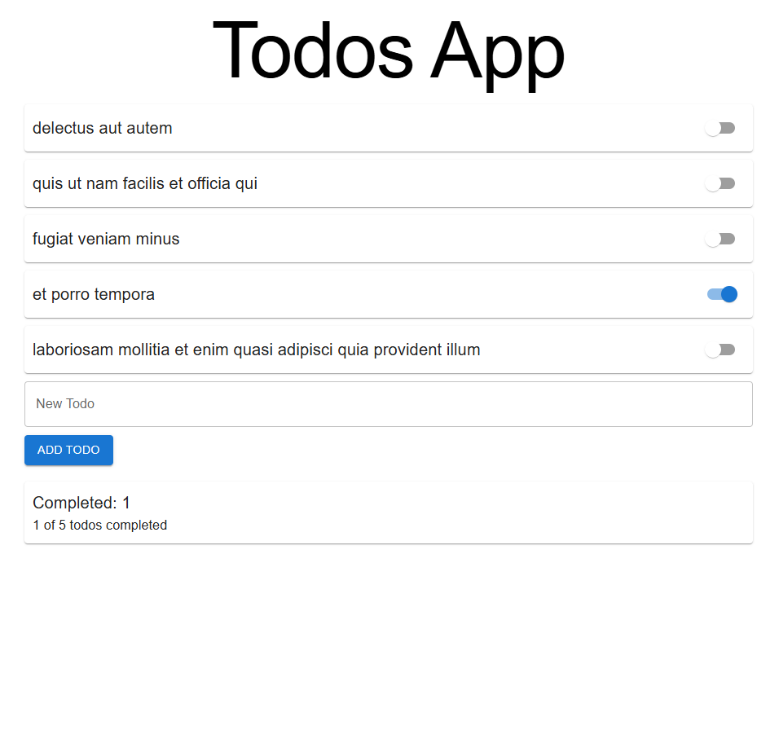
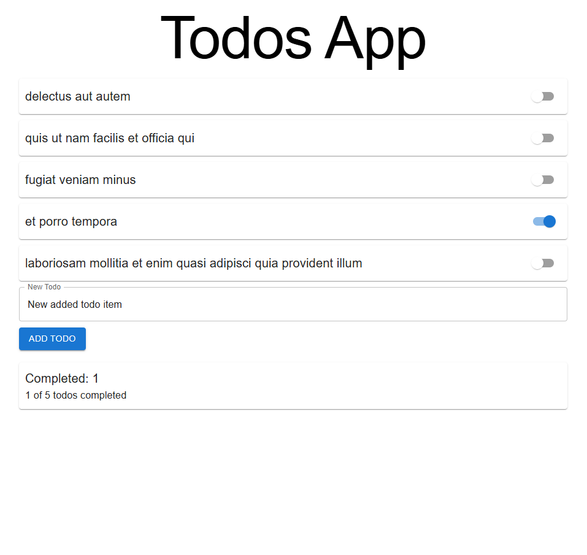
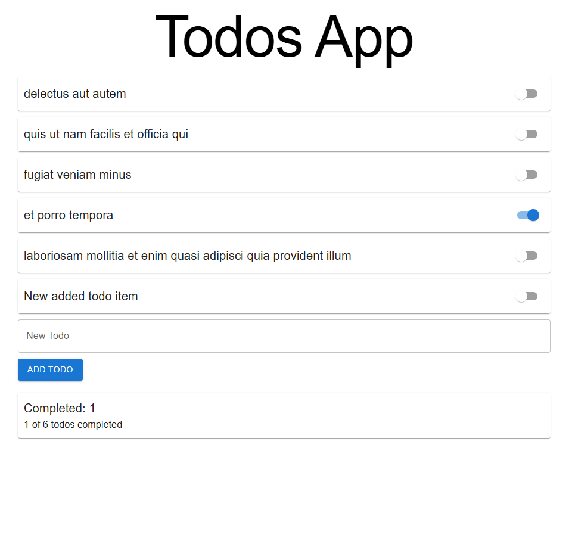
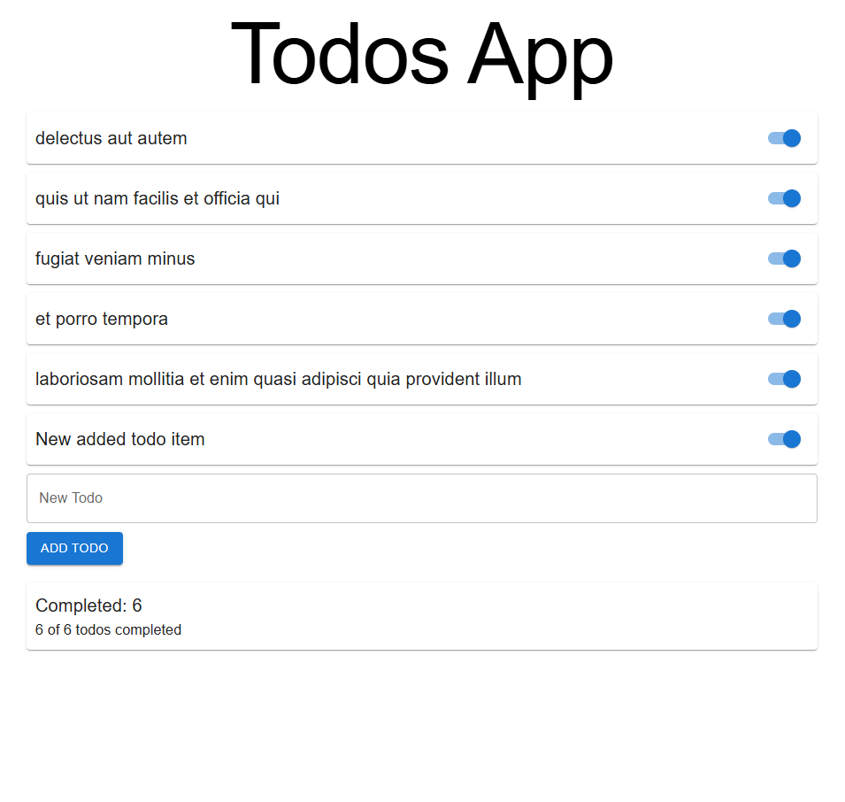

# Technologies & Concepts Learned

### React useState
- **What:** `useState` is a React Hook for managing local component state.
- **Where:** Used in `src/todos.tsx` to store the list of todos and in `src/components/new-todo.jsx` to manage the input field value.
- **Why:**
	- In `todos.tsx`, `useState` holds the array of todo items so the UI updates when you add, complete, or switch todos.
	- In `new-todo.jsx`, `useState` tracks the current value of the input so it can be cleared after adding a todo.

### React useMemo
- **What:** `useMemo` is a React Hook for memoizing expensive or derived values.
- **Where:** Used in `src/todos.tsx` to compute the list of completed todos.
- **Why:**
	- It avoids recalculating the completed todos array on every render unless the todos list changes, which is more efficient for larger lists.

### React useEffect
- **What:** `useEffect` is a React Hook for running side effects, such as fetching data from an API.
- **Where:** Used in `src/todos.tsx` to fetch the initial list of todos from a remote API when the component mounts.
- **Why:**
	- It allows the app to load data asynchronously and update the UI when the data arrives.
	- The effect only runs once on mount (empty dependency array).

### Loading State Management
- **What:** A `loading` state variable (with `useState`) is used to track whether the app is currently fetching data.
- **Where:** Used in `src/todos.tsx` to show a loading indicator while todos are being fetched.
- **Why:**
	- Improves user experience by providing feedback during asynchronous operations.

# App Screenshots

### 1. Fetching Todos (Loading)

### 2. Adding a New Todo

### 3. Checking a New Item

### 4. Marking as Completed

# React Todos App

## Technologies & Concepts Learned

### React useState
- **What:** `useState` is a React Hook for managing local component state.
- **Where:** Used in `src/todos.tsx` to store the list of todos and in `src/components/new-todo.jsx` to manage the input field value.
- **Why:**
	- In `todos.tsx`, `useState` holds the array of todo items so the UI updates when you add, complete, or switch todos.
	- In `new-todo.jsx`, `useState` tracks the current value of the input so it can be cleared after adding a todo.

### React useMemo
- **What:** `useMemo` is a React Hook for memoizing expensive or derived values.
- **Where:** Used in `src/todos.tsx` to compute the list of completed todos.
- **Why:**
	- It avoids recalculating the completed todos array on every render unless the todos list changes, which is more efficient for larger lists.

## App Screenshots

---
This project demonstrates React fundamentals, state management, and performance optimization with hooks.
# React + Vite

This template provides a minimal setup to get React working in Vite with HMR and some ESLint rules.

Currently, two official plugins are available:

- [@vitejs/plugin-react](https://github.com/vitejs/vite-plugin-react/blob/main/packages/plugin-react) uses [Babel](https://babeljs.io/) (or [oxc](https://oxc.rs) when used in [rolldown-vite](https://vite.dev/guide/rolldown)) for Fast Refresh
- [@vitejs/plugin-react-swc](https://github.com/vitejs/vite-plugin-react/blob/main/packages/plugin-react-swc) uses [SWC](https://swc.rs/) for Fast Refresh

## React Compiler

The React Compiler is not enabled on this template because of its impact on dev & build performances. To add it, see [this documentation](https://react.dev/learn/react-compiler/installation).

## Expanding the ESLint configuration

If you are developing a production application, we recommend using TypeScript with type-aware lint rules enabled. Check out the [TS template](https://github.com/vitejs/vite/tree/main/packages/create-vite/template-react-ts) for information on how to integrate TypeScript and [`typescript-eslint`](https://typescript-eslint.io) in your project.
